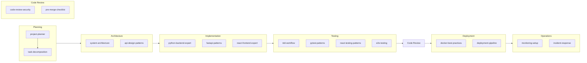

# AI1 Plugin — SDLC Agent Plugin for Python/React Projects

A **Claude Code plugin** with **17 Agent Skills** covering the full software development lifecycle for **Python (FastAPI) + React/TypeScript** projects. Also compatible with other tools via the [Agent Skills](https://agentskills.io) open standard.

## Quick Start

### Claude Code (plugin)

```bash
git clone https://github.com/hieutrtr/ai1-skills.git
claude --plugin-dir ./ai1-skills
```

Skills are namespaced under `ai1-skills:` to prevent conflicts:

```
/ai1-skills:project-planner Plan the user authentication feature
/ai1-skills:python-backend-expert Create a FastAPI endpoint for user registration
/ai1-skills:code-review-security Review the auth module for vulnerabilities
```

### Other tools (agentskills.sh CLI)

```bash
npx skills add hieutrtr/ai1-skills
```

| Starting a... | Guide |
|---------------|-------|
| **New project** from scratch | [Greenfield Guide](docs/greenfield.md) — step-by-step from planning to production |
| **Existing project** adoption | [Brownfield Guide](docs/brownfield.md) — incremental adoption, security-first |

See [Skill Composition Guide](docs/skill-composition.md) for how skills relate to each other.

## Skills Overview

| # | SDLC Phase | Skill | What It Does |
|---|------------|-------|--------------|
| 1 | Planning | `project-planner` | Feature breakdown, implementation plans, dependency mapping |
| 2 | Planning | `task-decomposition` | Atomic task splitting, persistent task files, sizing criteria |
| 3 | Architecture | `system-architecture` | Layer architecture, ADRs, database schema design |
| 4 | Architecture | `api-design-patterns` | REST conventions, Pydantic v2 schemas, pagination, error format |
| 5 | Implementation | `python-backend-expert` | FastAPI endpoints, repository pattern, SQLAlchemy 2.0, Alembic |
| 6 | Implementation | `fastapi-patterns` | Middleware, dependency injection, WebSocket, JWT auth, lifespan |
| 7 | Implementation | `react-frontend-expert` | Components, hooks, TanStack Query, forms, accessibility |
| 8 | Testing | `react-testing-patterns` | Testing Library, MSW, hook testing, accessibility assertions |
| 9 | Testing | `tdd-workflow` | Red-Green-Refactor enforcement for backend and frontend |
| 10 | Testing | `pytest-patterns` | Fixtures, factories, async testing, mocking, parametrize |
| 11 | Testing | `e2e-testing` | Playwright, page object model, auth reuse, CI integration |
| 12 | Code Review | `code-review-security` | OWASP Top 10, SQL injection, XSS, secrets detection |
| 13 | Code Review | `pre-merge-checklist` | Quality gates: linting, types, coverage, API compatibility |
| 14 | Deployment | `deployment-pipeline` | CI/CD stages, canary rollout, rollback, GitHub Actions |
| 15 | Deployment | `docker-best-practices` | Multi-stage builds, layer optimization, security, Compose |
| 16 | Operations | `incident-response` | Severity classification, diagnostics, runbooks, post-mortems |
| 17 | Operations | `monitoring-setup` | structlog, Prometheus, health checks, alerting, Sentry |

## SDLC Flow



## Installation

Clone the repo and load it as a plugin:

```bash
git clone https://github.com/hieutrtr/ai1-skills.git
claude --plugin-dir ./ai1-skills
```

To make it permanent, add it to your Claude Code settings:

```json
{
  "pluginDirectories": ["/path/to/ai1-skills"]
}
```

Run `/help` to verify — all skills appear under the `ai1-skills` namespace.

## Usage

### How skills activate

Skills use a **progressive disclosure** model with three levels:

1. **Level 1 — Metadata** (~100 tokens per skill): Skill descriptions are loaded at startup so Claude knows what's available.
2. **Level 2 — Full skill**: When Claude determines a skill is relevant to your request, it loads the complete `SKILL.md` into context.
3. **Level 3 — References**: Supporting files (`references/`, `scripts/`) are loaded on-demand only when the active skill references them.

You don't need to do anything special. Claude activates the right skill based on your request.

### Automatic activation

Just ask Claude naturally. The skill descriptions contain phase-specific keywords that trigger the correct skill:

```
# Activates project-planner
"Plan the implementation for adding user authentication"

# Activates python-backend-expert
"Create a new endpoint for user registration"

# Activates pytest-patterns
"Write tests for the user service"

# Activates code-review-security
"Review this code for security vulnerabilities"

# Activates deployment-pipeline
"Set up the CI/CD pipeline for this project"
```

### Direct invocation

When loaded as a Claude Code plugin, invoke skills with the `ai1-skills:` namespace prefix:

```
/ai1-skills:project-planner Add a payment processing module
/ai1-skills:python-backend-expert Create CRUD endpoints for orders
/ai1-skills:code-review-security Review the auth module
/ai1-skills:pre-merge-checklist Run all quality checks
/ai1-skills:tdd-workflow Implement the search feature using TDD
```

When installed as standalone skills (Option 2/3), use the short form without the prefix:

```
/project-planner Add a payment processing module
/python-backend-expert Create CRUD endpoints for orders
```

## How Skills Work Together

Skills compose across SDLC phases — each phase produces artifacts consumed by the next.

| Phase | Skills | Output |
|-------|--------|--------|
| Planning | `project-planner` → `task-decomposition` | Implementation plan → atomic task list |
| Architecture | `system-architecture` + `api-design-patterns` | ADRs, layer decisions, API contracts |
| Implementation | `python-backend-expert`, `fastapi-patterns`, `react-frontend-expert` | Backend + frontend code |
| Testing | `tdd-workflow` + `pytest-patterns` / `react-testing-patterns` / `e2e-testing` | Test-driven features, E2E coverage |
| Code Review | `code-review-security` → `pre-merge-checklist` | Security findings → quality gates |
| Deployment | `docker-best-practices` → `deployment-pipeline` | Container images → CI/CD pipeline |
| Operations | `monitoring-setup` → `incident-response` | Observability → runbooks |

For detailed composition rules, activation boundaries, and workflow diagrams, see:
- **[Skill Composition Guide](docs/skill-composition.md)** — how skills activate, relate, and when *not* to use one
- **[Greenfield Guide](docs/greenfield.md)** — full workflow for new projects (phases 1-8 in order)
- **[Brownfield Guide](docs/brownfield.md)** — incremental adoption for existing projects

## MCP Server Integration

Skills become more powerful when paired with [MCP servers](https://modelcontextprotocol.io) that provide live data access:

| Skill | MCP Server | What It Enables |
|-------|------------|-----------------|
| `project-planner`, `task-decomposition` | Jira MCP | Create issues, query backlog, link tasks |
| `python-backend-expert` | PostgreSQL MCP | Schema inspection during implementation |
| `pytest-patterns` | CI Server MCP | Trigger test runs, fetch coverage reports |
| `code-review-security`, `pre-merge-checklist` | GitHub MCP | Fetch PR diffs, post comments, check CI |
| `deployment-pipeline` | GitHub MCP, Kubernetes MCP | Trigger deploys, check pods, manage rollbacks |
| `incident-response` | Datadog/PagerDuty MCP | Query metrics, check alerts, manage incidents |
| `monitoring-setup` | Datadog MCP | Configure dashboards, verify alert rules |

## Skill anatomy

Each skill is a directory with this structure:

```
skill-name/
├── SKILL.md              # Main instructions (required, <500 lines)
├── references/           # Detailed docs, templates, examples (on-demand)
│   ├── template.md
│   └── patterns.md
└── scripts/              # Executable validation/automation scripts
    └── check.sh
```

### SKILL.md format

Every `SKILL.md` has YAML frontmatter and Markdown content:

```yaml
---
name: python-backend-expert
description: >-
  Python backend patterns for FastAPI with SQLAlchemy 2.0, Pydantic v2,
  and async patterns. Use during implementation when creating endpoints,
  models, or services. Does NOT cover testing (use pytest-patterns).
license: MIT
compatibility: 'Python 3.12+, FastAPI 0.115+, SQLAlchemy 2.0+, Pydantic v2'
metadata:
  author: platform-team
  version: '1.0.0'
  sdlc-phase: implementation
allowed-tools: Read Edit Write Bash(python:*) Bash(pip:*) Bash(alembic:*)
context: fork
---

# Python Backend Expert

## When to Use
...

## Instructions
...

## Examples
...

## Edge Cases
...
```

Key frontmatter fields:
- **`description`** — Controls when Claude activates the skill. Include phase keywords and negative keywords ("Does NOT cover...")
- **`allowed-tools`** — Restricts what tools Claude can use. Planning skills get read-only access; implementation skills get write access.
- **`context: fork`** — Runs the skill in an isolated subagent context

## Target stack

These skills encode conventions for:

| Layer | Technologies |
|-------|-------------|
| Backend | Python 3.12+, FastAPI 0.115+, SQLAlchemy 2.0+ (async), Pydantic v2, Alembic |
| Frontend | React 18+, TypeScript 5+, TanStack Query 5+, Vite 5+, React Hook Form + Zod |
| Testing | pytest + pytest-asyncio, Testing Library + Vitest, MSW 2+, Playwright |
| Code Quality | ruff, mypy (strict), ESLint, Prettier |
| Deployment | Docker (multi-stage), GitHub Actions, Prometheus, structlog, Sentry |

## Context budget

With all 17 skills installed, the context impact is minimal:

| Level | What loads | Token cost |
|-------|-----------|------------|
| Level 1 (always) | Skill descriptions for all 17 skills | ~1,700 tokens |
| Level 2 (on activation) | 1-2 active SKILL.md files | ~5,000-10,000 tokens |
| Level 3 (on demand) | Referenced files from `references/` | ~2,000-3,000 tokens |
| **Typical total** | | **~10,000-15,000 tokens** |

This is under 8% of a 200K context window.

## Customization

### Override a skill

To customize a skill for your project, copy it to your project's `.claude/skills/` and edit. Project-scoped skills take precedence over personal-scoped ones.

### Add project-specific conventions

Edit the relevant `SKILL.md` to add your team's conventions. For example, add your database naming conventions to `python-backend-expert`, or your component library patterns to `react-frontend-expert`.

### Extend with references

Add files to `references/` for large reference material. Reference them from `SKILL.md`:

```markdown
See [API catalog](references/api-catalog.md) for endpoint documentation.
```

Claude loads these only when the skill is active and references them.

## Compatibility

This repo is a **native Claude Code plugin** (via `.claude-plugin/plugin.json`). It also follows the [agentskills.io](https://agentskills.io) standard, so the same skills work with other tools when installed via Option 2/3:

| Tool | Installation | Skill invocation |
|------|-------------|-----------------|
| [Claude Code](https://claude.com/claude-code) | `--plugin-dir` | `/ai1-skills:skill-name` |
| [Cursor](https://cursor.sh) | `npx skills add` | `/skill-name` |
| [GitHub Copilot (VS Code)](https://code.visualstudio.com/docs/copilot/customization/agent-skills) | `npx skills add` | `/skill-name` |
| [OpenAI Codex](https://developers.openai.com/codex/skills/) | `npx skills add` | `/skill-name` |
| [Windsurf](https://windsurf.com) | `npx skills add` | `/skill-name` |

## License

MIT
